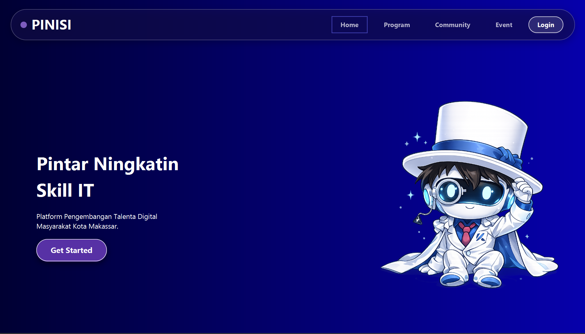
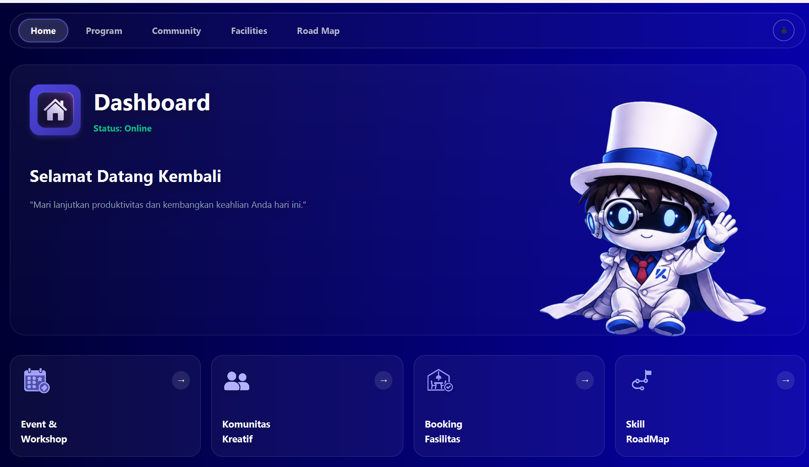
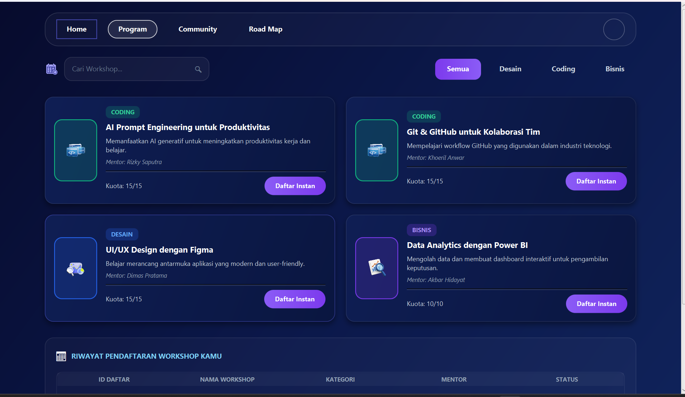
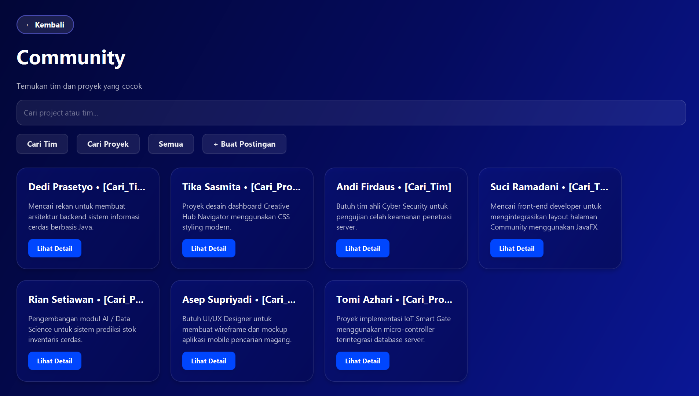
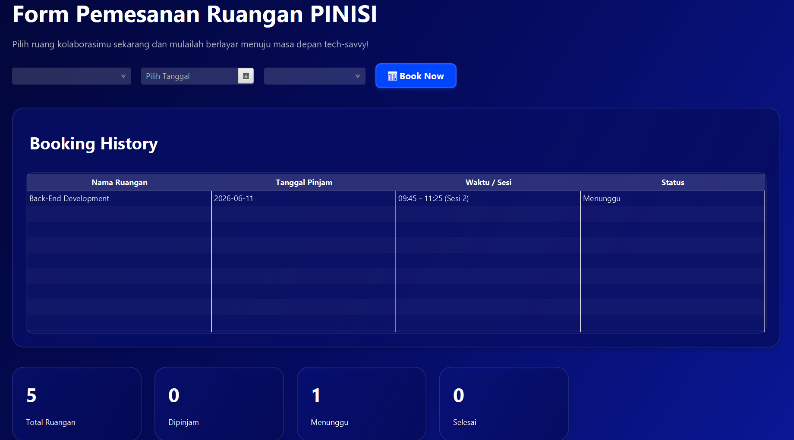
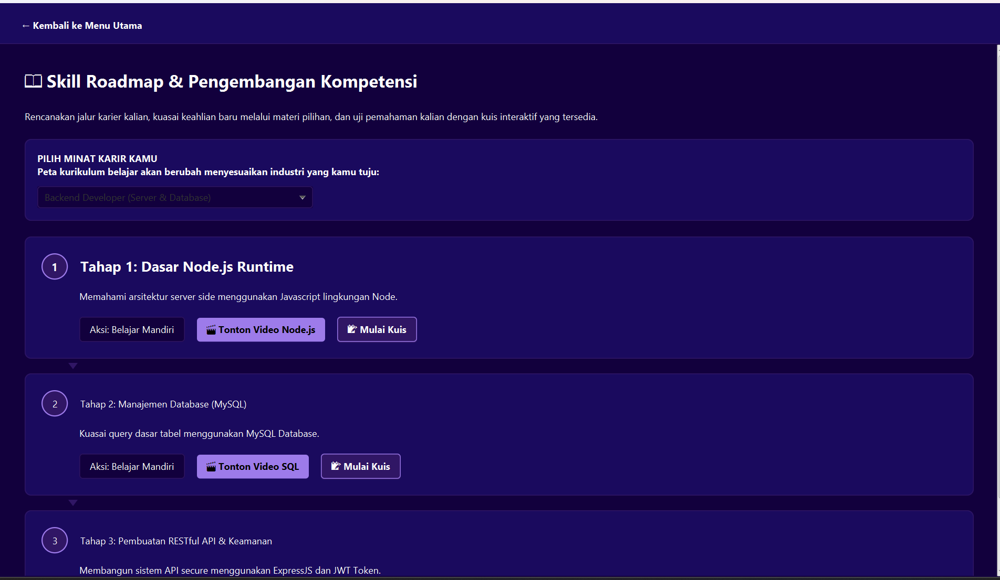

# 🚢 PINISI


## Platform Pelayanan Publik Digital untuk Pengembangan Talenta Teknologi Informasi

PINISI merupakan aplikasi desktop berbasis JavaFX yang dirancang untuk mendukung pengembangan keterampilan digital masyarakat melalui layanan workshop, komunitas kolaborasi, roadmap pembelajaran, dan booking fasilitas dalam satu platform terintegrasi.

Aplikasi ini terinspirasi dari Makassar Creative Hub sebagai ruang pengembangan kreativitas dan kolaborasi masyarakat serta dikembangkan sebagai proyek akhir mata kuliah Pemrograman Berorientasi Objek (PBO).

## ✨ Fitur Utama

| Fitur                         | Deskripsi                                                           |
| ----------------------------- | ------------------------------------------------------------------- |
| 🎓 Event & Workshop           | Menyediakan workshop dan program pengembangan keterampilan digital. |
| 🤝 Community & Collaboration  | Mendukung kolaborasi dan pengembangan komunitas kreatif.            |
| 🏢 Booking Fasilitas          | Memungkinkan pengguna melakukan reservasi fasilitas.                |
| 🗺️ Roadmap Skill Development | Menyediakan jalur pembelajaran yang terstruktur.                    |

## 📸 Tampilan Aplikasi

<p align="center">
  
</p>

<p align="center">
  
</p>

<p align="center">
  
</p>

<p align="center">
  
</p>
<p align="center">
  
</p>
<p align="center">
  
</p>

## 🚀 Cara Menjalankan Aplikasi

### Prasyarat

* Java JDK 17 atau lebih baru
* Gradle

### Menjalankan Program

```bash
./gradlew run
```

## 💾 Penyimpanan Data

Aplikasi ini belum menggunakan database.

Data pengguna, event, dan riwayat pendaftaran disimpan sementara menggunakan `ObservableList` (*in-memory storage*) selama aplikasi berjalan.

## 📁 Struktur Kode

```text
controller/
data/
model/
view/
Main.java
```

## 🧩 Penerapan Pilar OOP

### Encapsulation

Menggunakan atribut `private` serta getter dan setter untuk mengontrol akses data.

```java
private String kategori;
private String mentor;
private boolean terdaftar;
```

### Abstraction

Menggunakan abstract class `EntitasKreatif` sebagai dasar berbagai entitas dalam aplikasi.

```java
public abstract class EntitasKreatif {
    protected String nama;

    public abstract String getDeskripsiPeran();
}
```

### Inheritance

Menerapkan pewarisan dari class `EntitasKreatif`.

```java
public class Event extends EntitasKreatif
```

```java
public class CollabPost extends EntitasKreatif
```

### Polymorphism

Menerapkan overriding method `getDeskripsiPeran()` pada subclass.

```java
@Override
public String getDeskripsiPeran() {
    return "Event Kreatif";
}
```

```java
@Override
public String getDeskripsiPeran() {
    return "Postingan kolaborasi oleh " + namaPembuat;
}
```

## 👥 Tim Pengembang

### Kelompok 25

| NIM        | Nama                  |
| ---------- | --------------------- |
| H071251002 | Andi Fatimah Azzahrah |
| H071251005 | Mukhsin               |
| H071251073 | Ayu Anggraini         |

```
```
